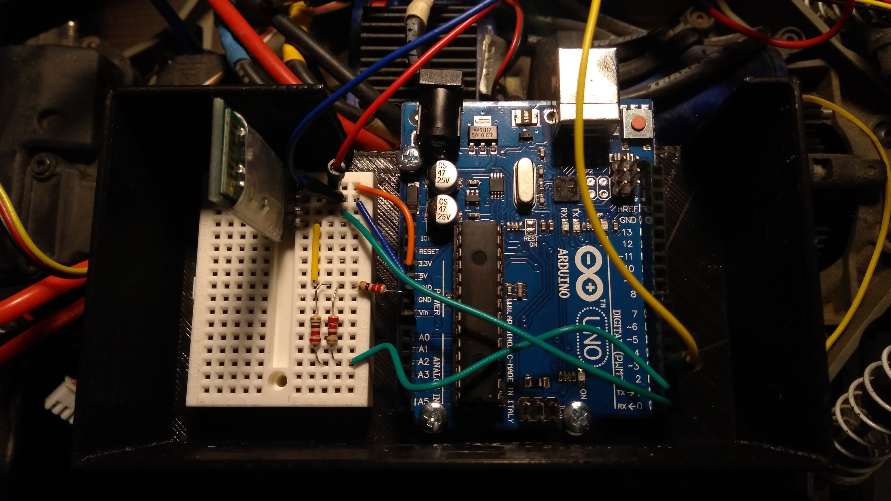
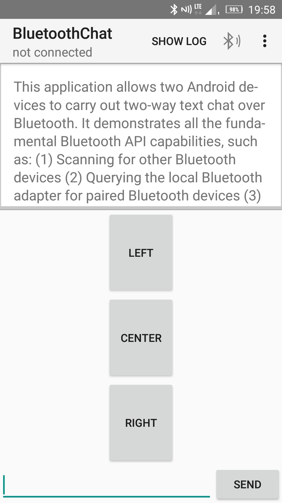

# Clint
Clint is a Traxxas Stampede 4x4 RC Car modified by me. It features a 5.8Ghz FPV system with the option of panning the camera.

[YT Vid](https://www.youtube.com/embed/WeP4QTIqyTM)

## Idea
I've always been a big fan of the automotive industry. My parents will testify that car brands were some of the first words I learned. At only a couple years old I knew not only the makes and models of cars, but in some cases the specs of the engine such as power and torque, as well as 0-60 times etc. Seeing as I wouldn't be able to drive a real car for many years that followed my dad got me the next best thing - an RC car. Not the one you saw in the video, mind You. After a couple delightful years spent with my first flame, I decided it was time to upgrade. The vehicle of choice? The Traxxas Stampede 4x4.

I got the car while still in primary school. With my head buzzing with excitement at the thought of driving a real car, I wanted to engage with automobiles as much as possible at the time. The new RC car was faster and tougher, but still far off from the real deal. That's when an idea was born - an FPV car. It'd be great! It would allow me to see where I was going from the perspective of an actual driver of an actual moving vehicle! I looked into the issue, but for lack of ability, resources and know-how, abandoned the idea.

Until now.

## Alpha
The first iteration was coarse. But glorious. With mounts made of nothing but off-the-shelf woodworking elements it was a true expression of my DIY soul.

It featured a 5.8Ghz FPV system, originally intended for drones. But in my truck it worked like a dream. Virtually zero latency, sharp image, little distortion. But my thirst for excellence was far from quenched...

## Clint v.2.0

This one was meant to impress. Did it succeed? Tell me Yourself:

[YT vid again](https://www.youtube.com/embed/WeP4QTIqyTM)

### Mounts
The carpentry-inspired mounts would not cut it for me, so I had to come up with a tidier solution. Hence, the 3D printed mounts.

The bottom one holds the main 7.4V battery down in the tub chassis and provides support for the secondary 12V battery, powering the electronics. Atop of that sits a box in which the Arduino and other circuitry is mounted. But more on that in a sec.

[SolidWorks Projects](CAD/)

*You will notice one of the models was never printed. It is the lid for the box, which was in no way special, had no structural importance, and would cost me 40PLN to print. I thought to myself "Well, cardboard lid it is, then."*

### Camera Panning
Formerly, the camera sat on its base zip-tied to the front shock tower. That meant that in order to look around I had to turn the entire car. This frustrated me, so I decided to put the camera on a servo, which would allow me to pan the camera. For controlling the servo I used an Arduino and an HC05 BT module, which enabled remote communication via a mobile phone. Here's a look under the ugly cardboard lid:

*Much nicer, isn't it?*

Connections:
- Arduino RX -> HC05 TX
- Arduino TX -> 2:1 Voltage Divider (5V to 3.3V) -> HC05 RX
- Arduino 5V -> HC05 VIN and Servo VIN
- Arduino GND -> Voltage Divider and HC05 GND and Servo GND

[Arduino Code](Program/Clint_BT/Clint_BT.ino)

Despite my lack of experience in mobile app development I decided to tackle the challenge. With the help of a breadth of online resources I managed to make some tweaks to some readily available code and get a really satisfactory outcome.

[BT App](Program/AndroidApp/)

This system is imperfect due to latency and limited options, among other reasons. However, I am planning to add functionality, such as a slider for adjusting the angle of the camera, as well as improve the responsiveness. In spite of the aforementioned shortcomings **I am proud of it**, as it delivers on the promise I set out to realize: to have a camera which I can pan to the left and right remotely.

### Driver side
Little attention was paid to the driver side in this article, but I figured it's also worth showcasing. This remained unchanged ever since the Alpha iteration of Clint. Making it ergonomic is a secondary concern at the current development stage.

[The driver's setup](Media/setup.jpg)

The mounts strap behind your belt which is mounting point one and two, the third one being your neck, from which the wooden construction hangs on a piece of rope. The screen is mounted to a bolt head and held down with rubber bands, as displayed in the YT video.

Needless to say, this marvel of engineering is my own creation.

## Summary

The Clint Project is one of my most ambitious yet. Nevertheless, I am never satisfied, so it remains an ongoing process. I hope You enjoyed this showcase of my imagination's offspring and invite You to check out its siblings, put on display in my other repos.

*Signed: RibsonZ*
